# CookShare 시스템 아키텍처 문서

> **버전**: 1.0.0 | **작성일**: 2026-03-18 | **모델**: C4 (Context → Container → Component → Code)

---

## 목차

1. [시스템 개요](#1-시스템-개요)
2. [C4 Level 1: System Context](#2-c4-level-1-system-context)
3. [C4 Level 2: Container Diagram](#3-c4-level-2-container-diagram)
4. [C4 Level 3: Component Diagram](#4-c4-level-3-component-diagram)
5. [C4 Level 4: Code Diagram](#5-c4-level-4-code-diagram)
6. [기술 스택](#6-기술-스택)
7. [통신 방식](#7-통신-방식)
8. [데이터 플로우](#8-데이터-플로우)
9. [보안 아키텍처](#9-보안-아키텍처)
10. [성능 전략](#10-성능-전략)
11. [배포 아키텍처](#11-배포-아키텍처)
12. [모니터링 & 운영](#12-모니터링--운영)
13. [확장성 설계](#13-확장성-설계)

---

## 1. 시스템 개요

**CookShare**는 사용자가 레시피를 작성·공유·탐색할 수 있는 커뮤니티 기반 레시피 공유 플랫폼입니다.

### 핵심 기능 (MVP)

| 분류 | 기능 |
|------|------|
| 인증 | 회원가입, 로그인, 로그아웃, JWT 토큰 관리 |
| 레시피 | 작성, 조회, 수정, 삭제, 이미지 업로드 |
| 탐색 | 검색, 카테고리 필터, 페이지네이션 |
| 소셜 | 좋아요, 조회수, 프로필 조회 |

### 아키텍처 원칙

- **레이어드 아키텍처**: Presentation → Business → Data Access → Infrastructure
- **단일 책임 원칙**: 각 모듈은 하나의 책임만 담당
- **의존성 역전**: 고수준 모듈이 저수준 모듈에 의존하지 않음
- **확장 가능한 모노리스**: MVP는 모노리스로 시작, 마이크로서비스로 전환 가능한 구조

---

## 2. C4 Level 1: System Context

> 시스템이 **누구**와 **어떤 외부 시스템**과 상호작용하는지 보여줍니다.

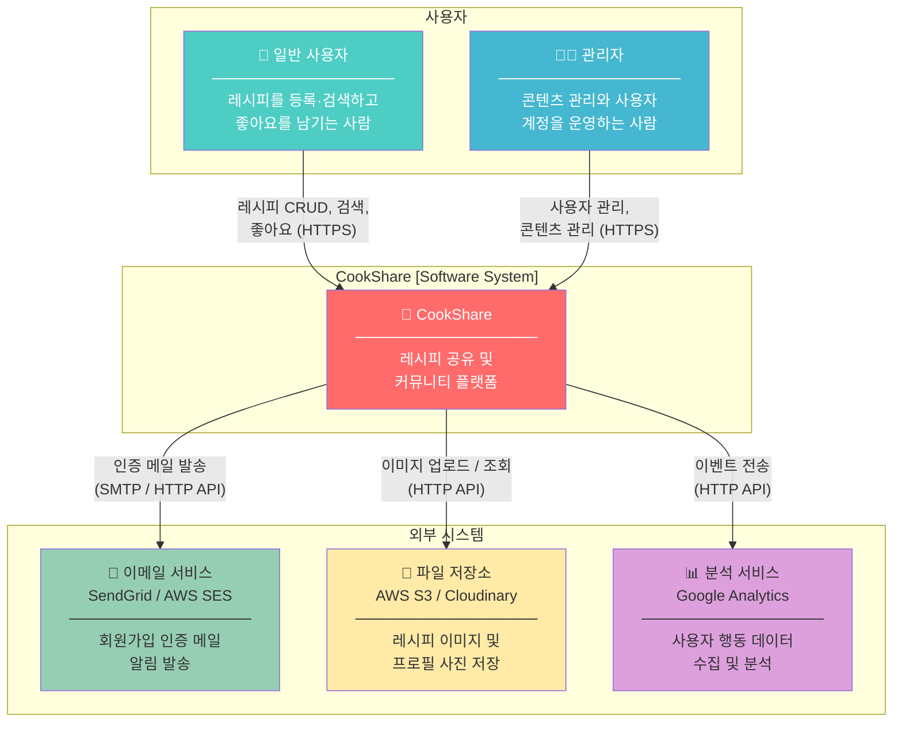

### 사용자 역할 정의

| 역할 | 권한 | 설명 |
|------|------|------|
| `user` | 레시피 CRUD (본인), 검색, 좋아요 | 기본 가입 사용자 |
| `admin` | 전체 사용자 관리, 모든 레시피 관리 | 시스템 운영자 |

---

## 3. C4 Level 2: Container Diagram

> 시스템 내부를 **컨테이너(독립 실행 단위)** 로 분해하여 기술 선택과 통신 방식을 보여줍니다.

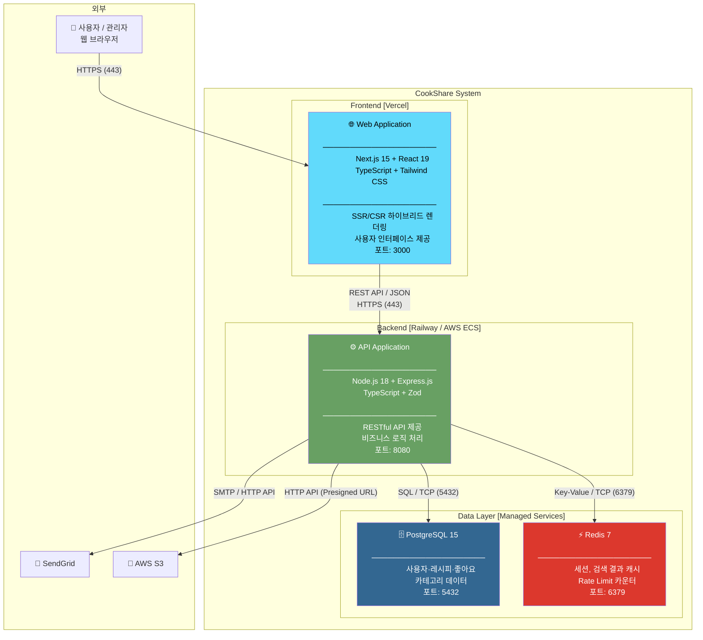

### 컨테이너별 책임 요약

| 컨테이너 | 기술 | 주요 책임 |
|----------|------|-----------|
| Web Application | Next.js 15, React 19, TypeScript | UI 렌더링, 사용자 입력 처리, API 통신 |
| API Application | Node.js, Express.js, Prisma | 비즈니스 로직, 인증/인가, DB 접근 |
| PostgreSQL | PostgreSQL 15 | 영구 데이터 저장, 트랜잭션 보장 |
| Redis | Redis 7 | 캐싱, 세션 관리, Rate Limiting |

---

## 4. C4 Level 3: Component Diagram

### 4-1. Frontend (Next.js) 컴포넌트

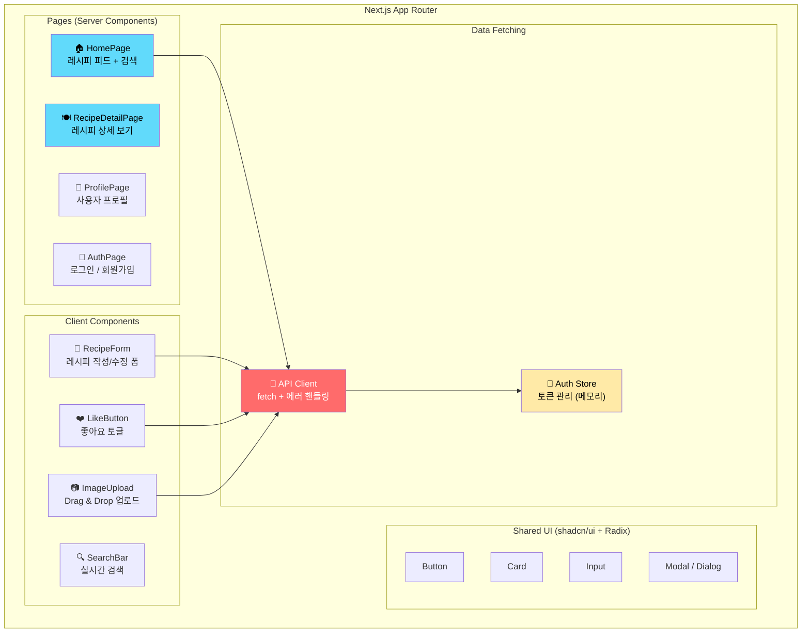

### 4-2. Backend (Express.js) 컴포넌트

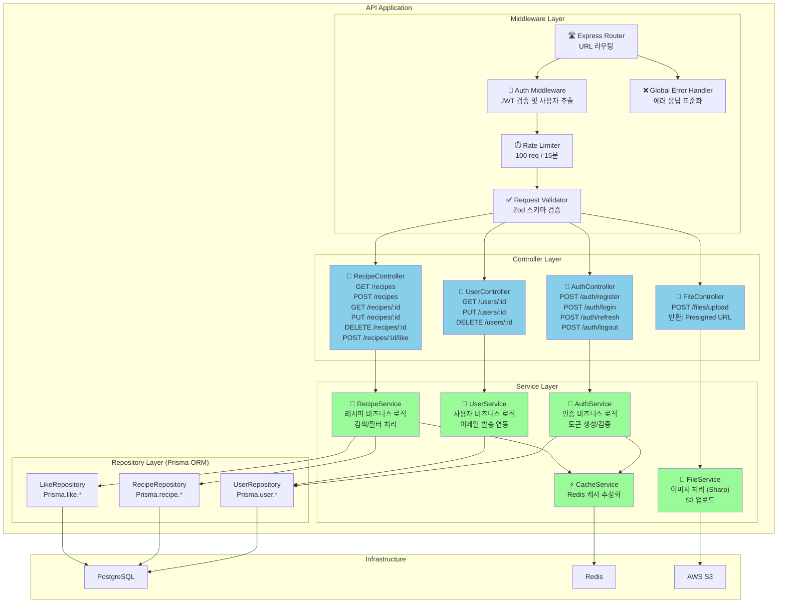

---

## 5. C4 Level 4: Code Diagram

> 핵심 모듈의 **클래스 구조와 인터페이스**를 보여줍니다.

### 5-1. 도메인 모델 (TypeScript Interfaces)

```typescript
// ── User 도메인 ──────────────────────────────────────────────
interface User {
  id: string;          // UUID v4
  email: string;       // 고유값, 소문자 정규화
  name: string;        // 2~100자
  role: 'user' | 'admin';
  createdAt: Date;
  updatedAt: Date;
}

// ── Recipe 도메인 ────────────────────────────────────────────
interface Recipe {
  id: string;          // UUID v4
  userId: string;      // FK → User.id
  title: string;       // 최대 200자
  description: string;
  ingredients: Ingredient[];
  instructions: Step[];
  category: string;    // FK → Category.name
  cookingTime: number; // 분 단위
  servings: number;
  mainImage: string;   // S3 URL
  images: string[];    // S3 URL 배열
  viewCount: number;
  likeCount: number;
  isPublished: boolean;
  createdAt: Date;
  updatedAt: Date;
}

interface Ingredient { name: string; amount: string; }
interface Step       { step: number; content: string; }

// ── API 응답 표준 구조 ────────────────────────────────────────
interface ApiResponse<T> {
  data: T;
  message?: string;
}

interface ApiError {
  error: string;  // 사람이 읽을 수 있는 메시지
  code: string;   // 머신 리더블 코드 (e.g. USER_NOT_FOUND)
  details?: Record<string, ValidationDetail>;
}
```

### 5-2. Repository 패턴

```typescript
// 추상 인터페이스 (의존성 역전)
interface IUserRepository {
  findById(id: string): Promise<User | null>;
  findByEmail(email: string): Promise<User | null>;
  create(data: CreateUserDto): Promise<User>;
  update(id: string, data: UpdateUserDto): Promise<User>;
  delete(id: string): Promise<void>;
}

// Prisma 구현체
class UserRepository implements IUserRepository {
  constructor(private readonly prisma: PrismaClient) {}

  async findById(id: string): Promise<User | null> {
    return this.prisma.user.findUnique({ where: { id } });
  }
  // ... 나머지 메서드
}
```

### 5-3. Service 레이어 패턴

```typescript
class AuthService {
  constructor(
    private readonly userRepo: IUserRepository,
    private readonly cacheService: CacheService,
  ) {}

  async login(email: string, password: string): Promise<TokenPair> {
    const user = await this.userRepo.findByEmail(email);
    if (!user) throw new AppError('USER_NOT_FOUND', 404);

    const valid = await bcrypt.compare(password, user.password);
    if (!valid) throw new AppError('INVALID_CREDENTIALS', 401);

    const accessToken  = jwt.sign({ sub: user.id, role: user.role },
                                   process.env.JWT_SECRET!, { expiresIn: '15m' });
    const refreshToken = jwt.sign({ sub: user.id },
                                   process.env.JWT_REFRESH_SECRET!, { expiresIn: '7d' });

    await this.cacheService.set(`refresh:${user.id}`, refreshToken, 60 * 60 * 24 * 7);
    return { accessToken, refreshToken };
  }
}
```

### 5-4. 데이터베이스 스키마 (ERD)

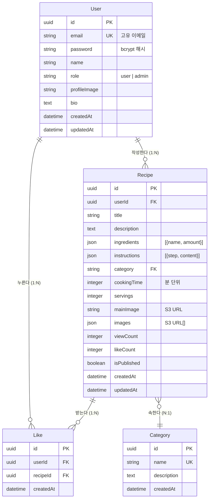

### 5-5. 인덱스 전략

```sql
-- 검색 성능 최적화
CREATE INDEX idx_recipe_title_search ON "Recipe" USING GIN (to_tsvector('korean', title));
CREATE INDEX idx_recipe_category     ON "Recipe" (category);
CREATE INDEX idx_recipe_user_id      ON "Recipe" (userId);
CREATE INDEX idx_recipe_published    ON "Recipe" (isPublished, createdAt DESC);
CREATE INDEX idx_like_composite      ON "Like" (userId, recipeId);
CREATE UNIQUE INDEX uidx_like        ON "Like" (userId, recipeId); -- 중복 좋아요 방지
```

---

## 6. 기술 스택

### Frontend

| 범주 | 기술 | 버전 | 이유 |
|------|------|------|------|
| 프레임워크 | Next.js | 15.5.2 | SSR/CSR 하이브리드, App Router |
| UI 라이브러리 | React | 19.1.1 | 최신 concurrent 기능 |
| 언어 | TypeScript | 5.9 | 타입 안전성, 런타임 에러 방지 |
| 스타일링 | Tailwind CSS | v4 | 유틸리티 우선, 번들 크기 최소화 |
| UI 컴포넌트 | Radix UI + shadcn/ui | - | 접근성 보장, 헤드리스 컴포넌트 |
| 패키지 매니저 | pnpm | 8.15 | 디스크 효율, 빠른 설치 |
| 테스트 | Jest + Playwright | 29, 1.51 | 단위/E2E 테스트 |
| 린팅 | ESLint 9 + Prettier | 9, 3.6 | 코드 품질 일관성 |

### Backend

| 범주 | 기술 | 버전 | 이유 |
|------|------|------|------|
| 런타임 | Node.js | 18 LTS | 안정성, 생태계 |
| 프레임워크 | Express.js | 4.x | 경량, 풍부한 미들웨어 |
| 언어 | TypeScript | 5.x | 타입 안전성 |
| ORM | Prisma | 5.x | 타입 안전 쿼리, 마이그레이션 |
| 인증 | JWT (jsonwebtoken) | - | Stateless 인증 |
| 비밀번호 | bcrypt | - | 단방향 해시 |
| 입력 검증 | Zod | 3.x | 런타임 타입 검증 |
| 이미지 처리 | Multer + Sharp | - | 멀티파트, WebP 변환 |
| 보안 | Helmet.js | - | HTTP 보안 헤더 |
| Rate Limit | express-rate-limit | - | API 남용 방지 |

### 인프라 & DevOps

| 범주 | 기술 | 설명 |
|------|------|------|
| 컨테이너 | Docker + Compose | 개발/프로덕션 환경 일관성 |
| CI/CD | GitHub Actions | 자동 테스트, 빌드, 배포 |
| 프론트엔드 호스팅 | Vercel | 자동 CDN, Preview 배포 |
| 백엔드 호스팅 | Railway / AWS ECS | 컨테이너 기반 배포 |
| DB | PostgreSQL 15 | ACID 보장, Full-Text Search |
| 캐시 | Redis 7 | 인메모리 캐시, Pub/Sub |
| 파일 저장 | AWS S3 | 내구성 11 9s, CDN 연동 |
| 모니터링 | Sentry + Grafana | 에러 추적, 메트릭 시각화 |
| 로깅 | Winston + CloudWatch | 구조화된 로그 수집 |

---

## 7. 통신 방식

### 7-1. Frontend ↔ Backend (REST API)

```
프로토콜: HTTPS (TLS 1.3)
형식:     JSON (Content-Type: application/json)
인증:     Authorization: Bearer <JWT>
버전:     /api/v1/
```

**API 엔드포인트 목록**

| Method | Path | 인증 | 설명 |
|--------|------|------|------|
| GET | `/health` | 없음 | 서버 상태 확인 |
| POST | `/api/users` | 없음 | 회원가입 |
| GET | `/api/users/:id` | 필요 | 사용자 조회 |
| PUT | `/api/users/:id` | 필요 (본인/admin) | 사용자 수정 |
| DELETE | `/api/users/:id` | admin | 사용자 삭제 |
| POST | `/api/auth/login` | 없음 | 로그인 |
| POST | `/api/auth/refresh` | 없음 | 토큰 갱신 |
| POST | `/api/auth/logout` | 필요 | 로그아웃 |
| GET | `/api/recipes` | 없음 | 레시피 목록 |
| POST | `/api/recipes` | 필요 | 레시피 작성 |
| GET | `/api/recipes/:id` | 없음 | 레시피 상세 |
| PUT | `/api/recipes/:id` | 필요 (작성자) | 레시피 수정 |
| DELETE | `/api/recipes/:id` | 필요 (작성자/admin) | 레시피 삭제 |
| POST | `/api/recipes/:id/like` | 필요 | 좋아요 토글 |
| POST | `/api/files/upload` | 필요 | 이미지 업로드 |

**에러 코드 체계**

| HTTP | Code | 설명 |
|------|------|------|
| 400 | `VALIDATION_ERROR` | 입력값 검증 실패 |
| 400 | `EMAIL_EXISTS` | 이미 사용 중인 이메일 |
| 401 | `NO_TOKEN` | Authorization 헤더 없음 |
| 401 | `TOKEN_EXPIRED` | 토큰 만료 |
| 401 | `INVALID_TOKEN` | 서명 검증 실패 |
| 403 | `FORBIDDEN` | 권한 없음 (본인 외 수정 시도) |
| 403 | `ADMIN_REQUIRED` | 관리자 권한 필요 |
| 404 | `USER_NOT_FOUND` | 사용자 없음 |
| 404 | `RECIPE_NOT_FOUND` | 레시피 없음 |
| 500 | `INTERNAL_ERROR` | 서버 내부 오류 |

### 7-2. Backend ↔ PostgreSQL

```
프로토콜:  TCP (포트 5432)
드라이버:  @prisma/client
방식:      Connection Pool (max: 10, min: 2)
SSL:       프로덕션 환경에서 필수
```

### 7-3. Backend ↔ Redis

```
프로토콜: TCP (포트 6379)
클라이언트: ioredis
인코딩:    JSON 직렬화
TTL 전략:
  - 검색 캐시:  5분
  - 레시피 캐시: 10분
  - Refresh 토큰: 7일
  - Rate Limit 카운터: 15분
```

### 7-4. Backend ↔ AWS S3

```
방식:     Presigned URL (보안 직접 업로드)
흐름:     API 서버가 Presigned URL 발급 → 클라이언트가 S3 직접 업로드
CDN:      CloudFront 연동으로 이미지 배포
처리:     업로드 전 Sharp로 WebP 변환, 썸네일 생성
```

---

## 8. 데이터 플로우

### 8-1. 회원가입 & 로그인 플로우

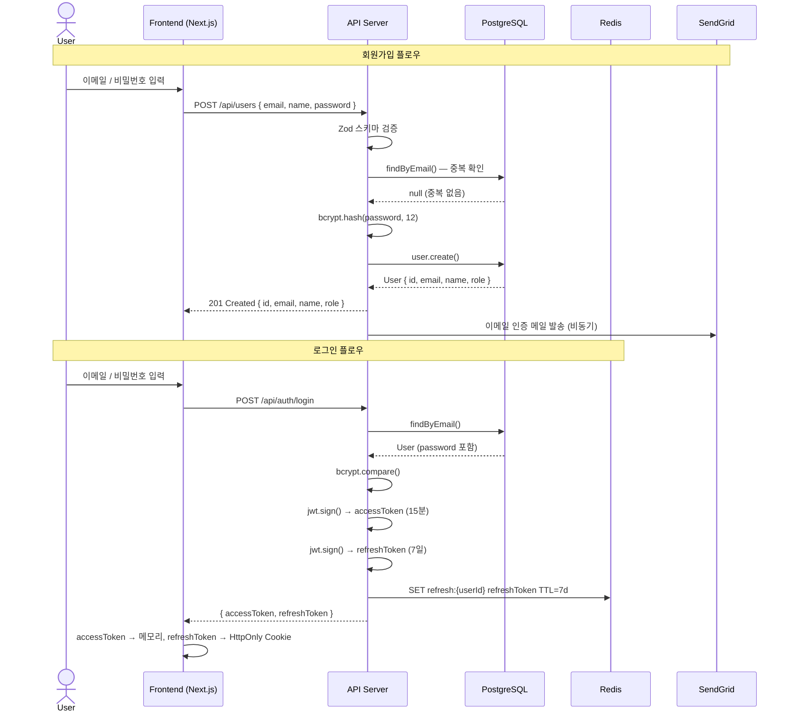

### 8-2. 레시피 작성 플로우

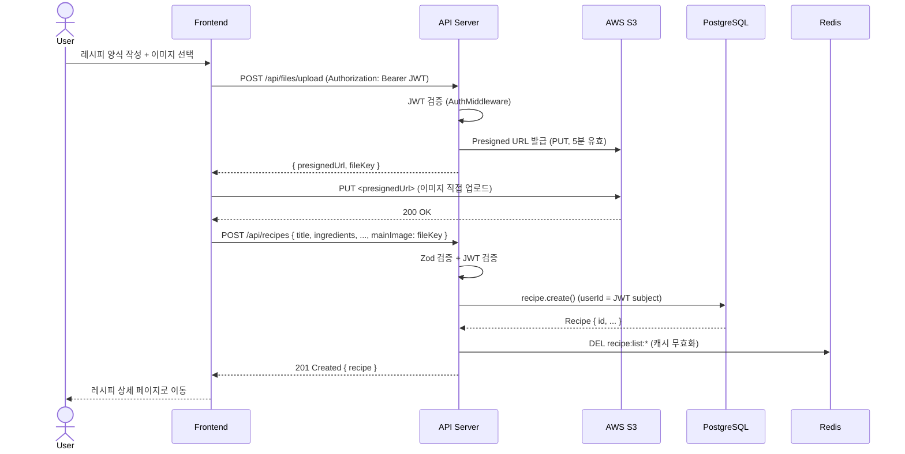

### 8-3. 레시피 검색 플로우 (캐시 포함)

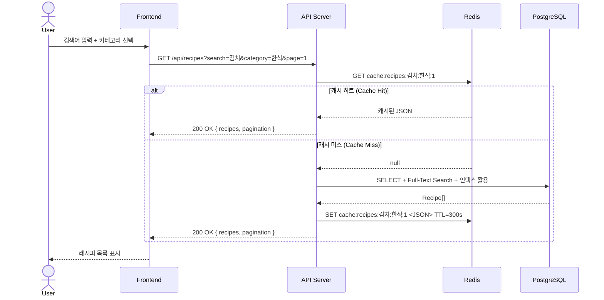

### 8-4. 좋아요 토글 플로우

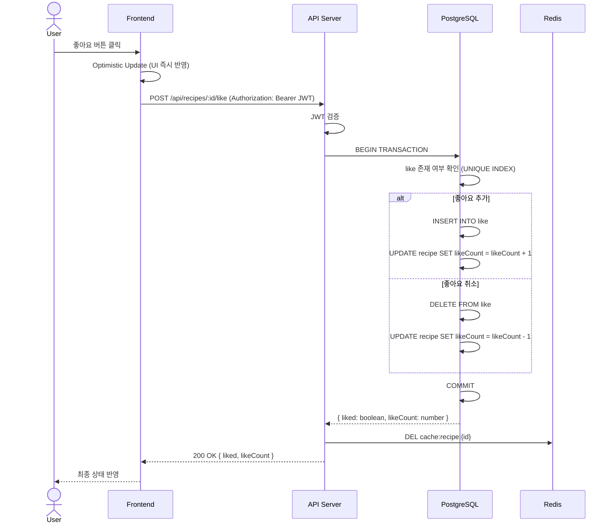

### 8-5. 토큰 갱신 플로우

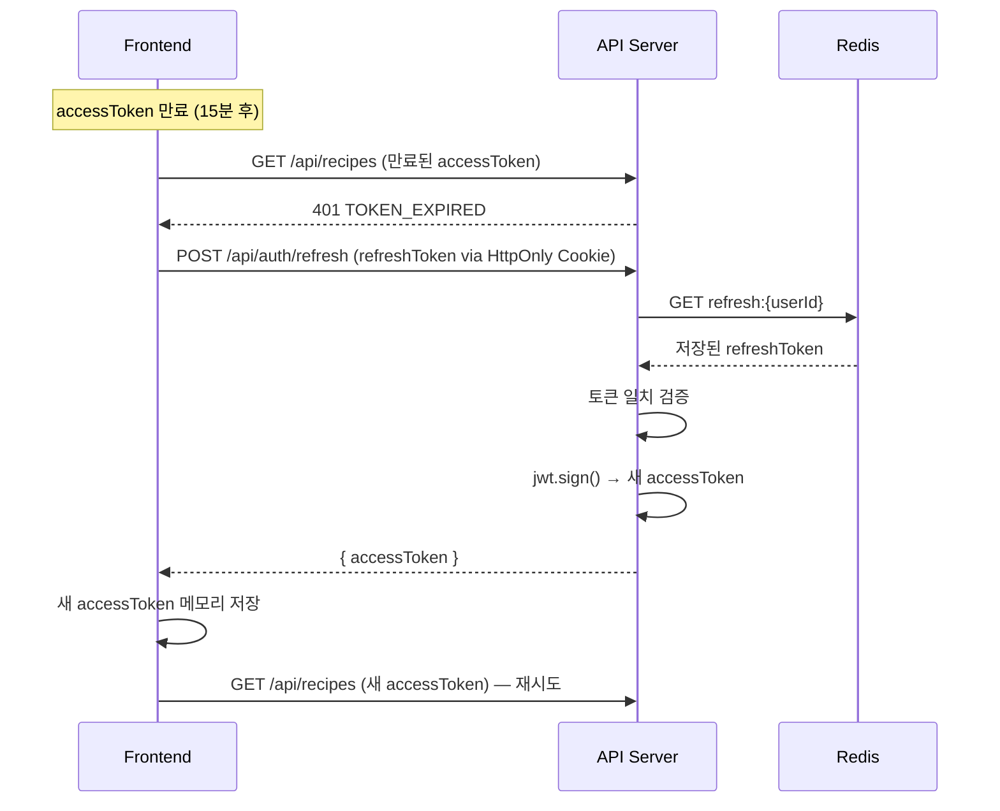

---

## 9. 보안 아키텍처

### 9-1. 인증 & 인가 계층

```
┌─────────────────────────────────────────────┐
│              요청 수신 (HTTPS)               │
├─────────────────────────────────────────────┤
│     Rate Limiter (100 req/15min/IP)         │
├─────────────────────────────────────────────┤
│     Helmet.js (보안 HTTP 헤더 설정)          │
│     X-Frame-Options, CSP, HSTS 등           │
├─────────────────────────────────────────────┤
│     CORS (허용 Origin 화이트리스트)          │
├─────────────────────────────────────────────┤
│     Request Body 크기 제한 (10MB)           │
├─────────────────────────────────────────────┤
│     Zod 스키마 입력 검증                     │
├─────────────────────────────────────────────┤
│     JWT 인증 미들웨어                        │
│     - 서명 검증 (HS256)                     │
│     - 만료 시간 검증                         │
│     - 사용자 존재 여부 확인                  │
├─────────────────────────────────────────────┤
│     역할 기반 인가 (RBAC)                   │
│     - user: 본인 데이터만                   │
│     - admin: 전체 데이터                    │
├─────────────────────────────────────────────┤
│              비즈니스 로직                   │
└─────────────────────────────────────────────┘
```

### 9-2. 보안 설정 요약

| 항목 | 설정 | 비고 |
|------|------|------|
| 비밀번호 해싱 | bcrypt (rounds: 12) | 브루트포스 방어 |
| Access Token | JWT HS256, TTL 15분 | 메모리에만 저장 |
| Refresh Token | JWT HS256, TTL 7일 | HttpOnly Cookie + Redis |
| HTTPS | TLS 1.3 | 전송 구간 암호화 |
| SQL Injection | Prisma ORM (파라미터 바인딩) | Raw Query 금지 |
| XSS | CSP 헤더 + 입력 이스케이프 | Helmet.js |
| CSRF | SameSite=Strict Cookie | refreshToken 보호 |
| Rate Limiting | 100 req/15min/IP | express-rate-limit |
| 파일 업로드 | Presigned URL (S3 직접 업로드) | 서버 메모리 무부하 |
| 파일 타입 검사 | MIME 타입 + magic bytes 검증 | WebP/JPG/PNG 허용 |

---

## 10. 성능 전략

### 10-1. 다층 캐싱 전략

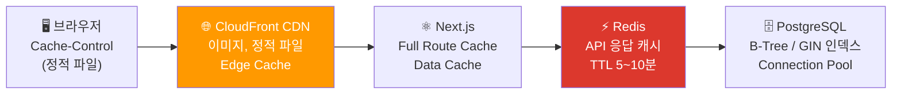

### 10-2. 데이터베이스 최적화

| 기법 | 적용 위치 | 효과 |
|------|-----------|------|
| B-Tree 인덱스 | `recipe.userId`, `recipe.category`, `like(userId, recipeId)` | 필터링 쿼리 속도 향상 |
| GIN 인덱스 | `recipe.title` (Full-Text Search) | 한국어 텍스트 검색 |
| Cursor 페이지네이션 | 레시피 목록 API | Offset 방식 대비 일관된 성능 |
| Eager Loading | 레시피 상세 조회 (`include: { user, likes }`) | N+1 문제 방지 |
| Connection Pool | PgPool (max 10, min 2) | DB 연결 재사용 |
| 읽기 전용 쿼리 | PostgreSQL Replica 라우팅 (확장 시) | 주 DB 부하 분산 |

### 10-3. Frontend 최적화

| 기법 | 설명 |
|------|------|
| Server Components | 초기 HTML 서버 렌더링, JS 번들 감소 |
| Code Splitting | 라우트별 자동 번들 분할 (Next.js App Router) |
| Image Optimization | `next/image` + WebP 자동 변환, Lazy Loading |
| Streaming SSR | `Suspense` 경계로 점진적 렌더링 |
| React Query | API 응답 클라이언트 캐싱 + Stale-While-Revalidate |

---

## 11. 배포 아키텍처

### 11-1. 개발 환경 (Docker Compose)

```yaml
# docker-compose.dev.yml 구성
services:
  web:       Next.js (포트 3000)
  db:        PostgreSQL 16-Alpine (포트 5432)
  redis:     Redis 7-Alpine (포트 6379)
  pgadmin:   pgAdmin 4 (포트 5050, DB 관리 UI)
  redis-ui:  RedisInsight (포트 8001, Redis 관리 UI)
```

### 11-2. CI/CD 파이프라인

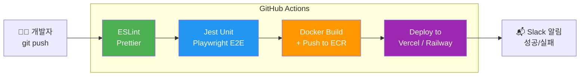

### 11-3. 프로덕션 환경

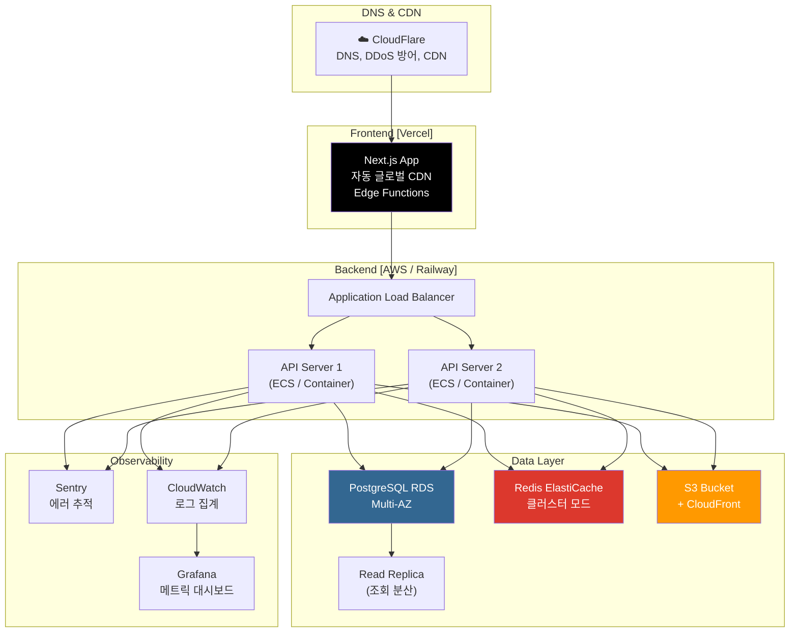

---

## 12. 모니터링 & 운영

### 12-1. 로그 구조 (Winston)

```json
{
  "timestamp": "2026-03-18T09:00:00.000Z",
  "level": "info",
  "service": "cookshare-api",
  "traceId": "abc123",
  "userId": "uuid",
  "method": "POST",
  "path": "/api/recipes",
  "statusCode": 201,
  "responseTime": 45,
  "message": "Recipe created"
}
```

### 12-2. 알림 임계값

| 심각도 | 조건 | 대응 |
|--------|------|------|
| Critical | 서버 다운, DB 연결 실패, 에러율 > 5% | 즉시 온콜 알림 |
| Warning | 응답 시간 P99 > 2초, Redis 메모리 > 80% | 슬랙 알림 |
| Info | 배포 완료, 일일 가입자 보고 | 슬랙 알림 |

### 12-3. 주요 모니터링 메트릭

| 지표 | 목표값 |
|------|--------|
| API 응답시간 P50 | < 100ms |
| API 응답시간 P99 | < 500ms |
| 에러율 (5xx) | < 0.1% |
| 가용성 | > 99.9% |
| Redis 캐시 히트율 | > 80% |
| DB 쿼리 P99 | < 100ms |

---

## 13. 확장성 설계

### 13-1. 수평 확장 (현재 → 미래)

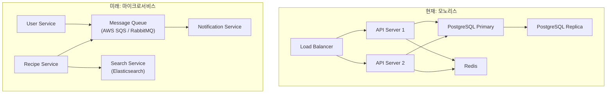

### 13-2. 마이크로서비스 전환 계획

| 서비스 | 분리 기준 | 독립 DB |
|--------|-----------|---------|
| User Service | 인증/인가 도메인 | PostgreSQL (users) |
| Recipe Service | 레시피 CRUD, 검색 | PostgreSQL (recipes) |
| Interaction Service | 좋아요, 댓글, 팔로우 | Redis + PostgreSQL |
| Notification Service | 이메일, 푸시 알림 | 이벤트 기반 (SQS) |
| Search Service | 전문 검색 | Elasticsearch |

---

## 결론

CookShare 아키텍처는 **MVP 단계의 개발 속도**와 **미래 확장성** 사이의 균형을 목표로 설계되었습니다.

### 핵심 설계 결정 (ADR 요약)

| 결정 | 선택 | 이유 |
|------|------|------|
| 아키텍처 패턴 | 레이어드 모노리스 | MVP 빠른 개발, 마이크로서비스 전환 용이 |
| 렌더링 전략 | Next.js SSR/CSR 하이브리드 | SEO + 인터랙티브 UX |
| 인증 방식 | JWT (Stateless) | 수평 확장 시 세션 공유 불필요 |
| ORM | Prisma | 타입 안전, 마이그레이션 관리 |
| 캐싱 | Redis + Next.js Cache | 다층 캐싱으로 DB 부하 최소화 |
| 파일 저장 | S3 Presigned URL | 서버 무부하 직접 업로드 |

```
확장 가능한 모노리스 → 서비스별 분리 → 마이크로서비스
      (현재)              (트래픽 증가 시)    (대규모 운영 시)
```
